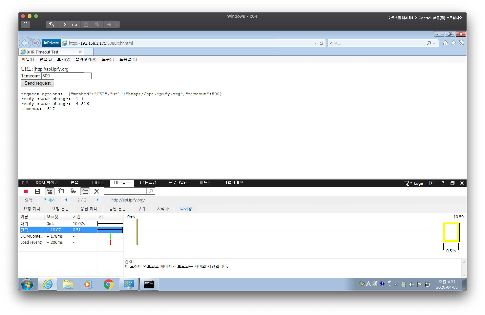
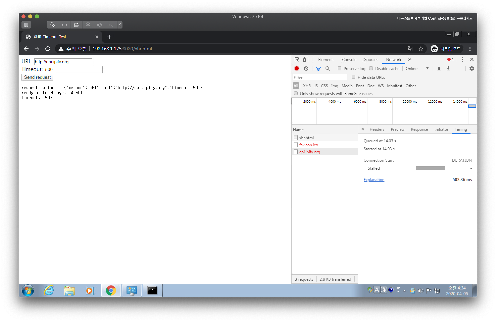
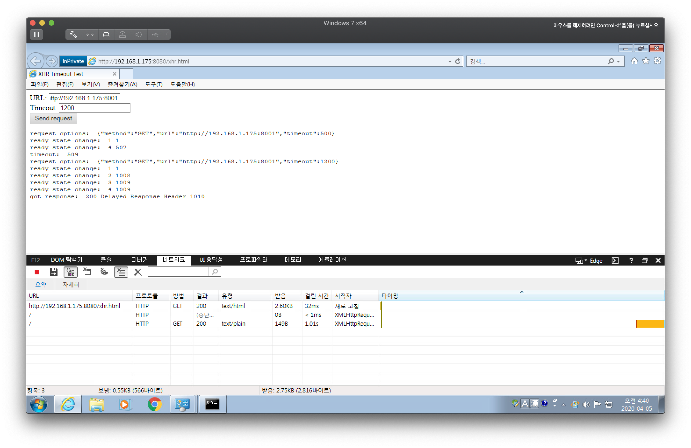
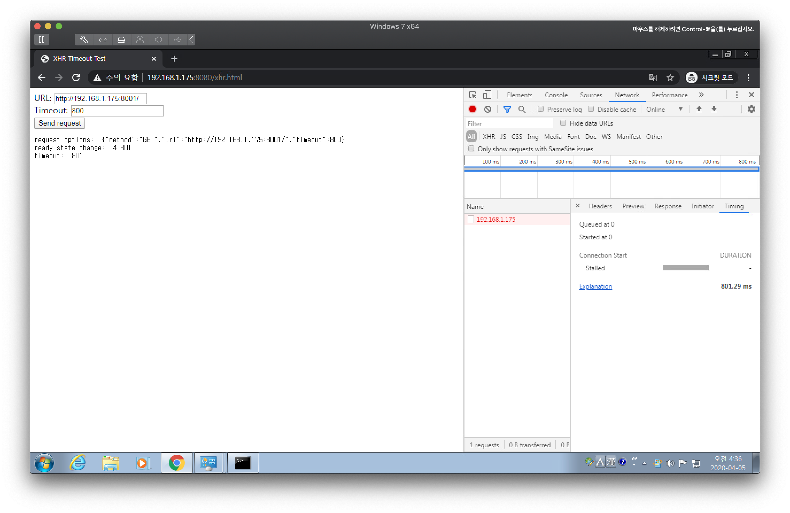
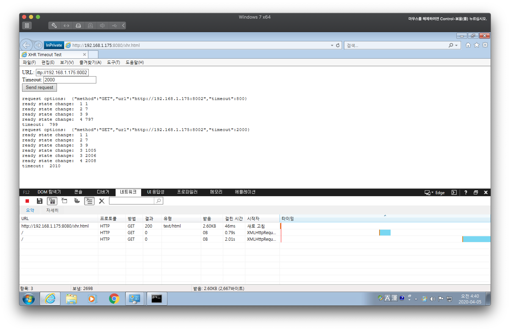
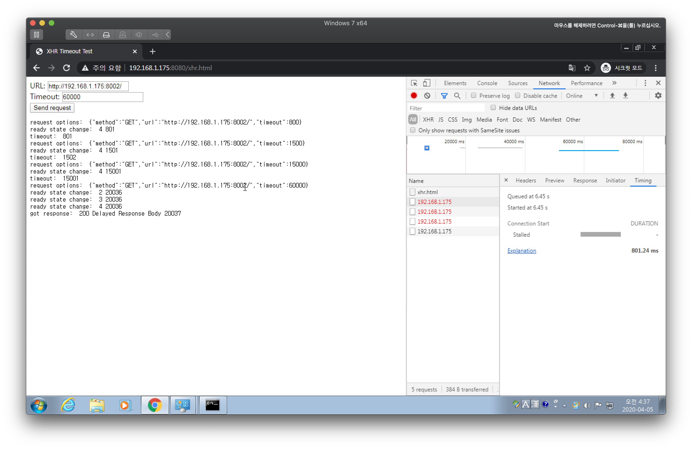
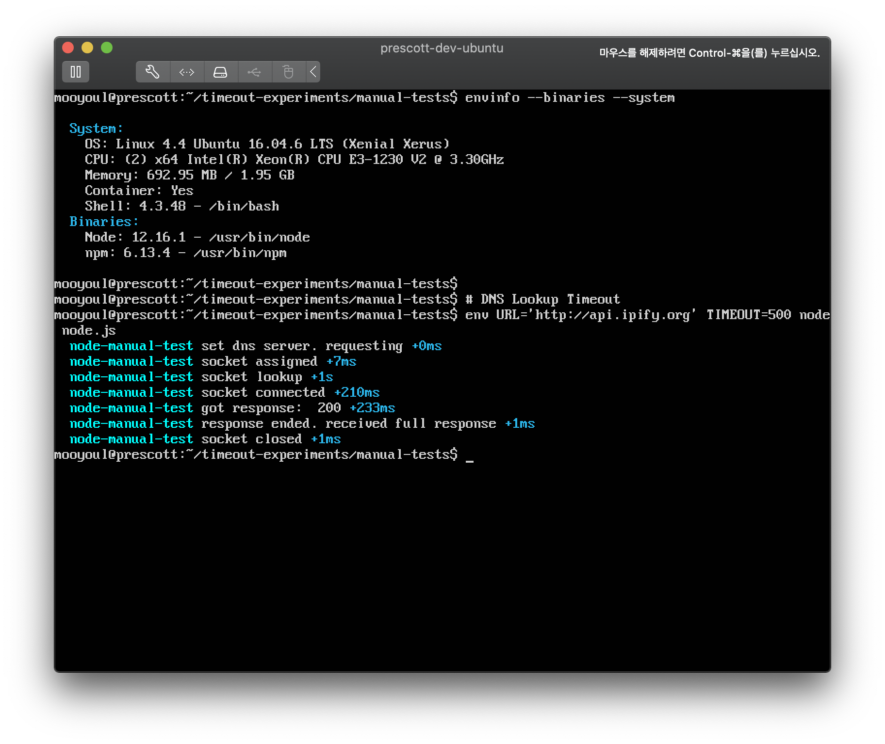
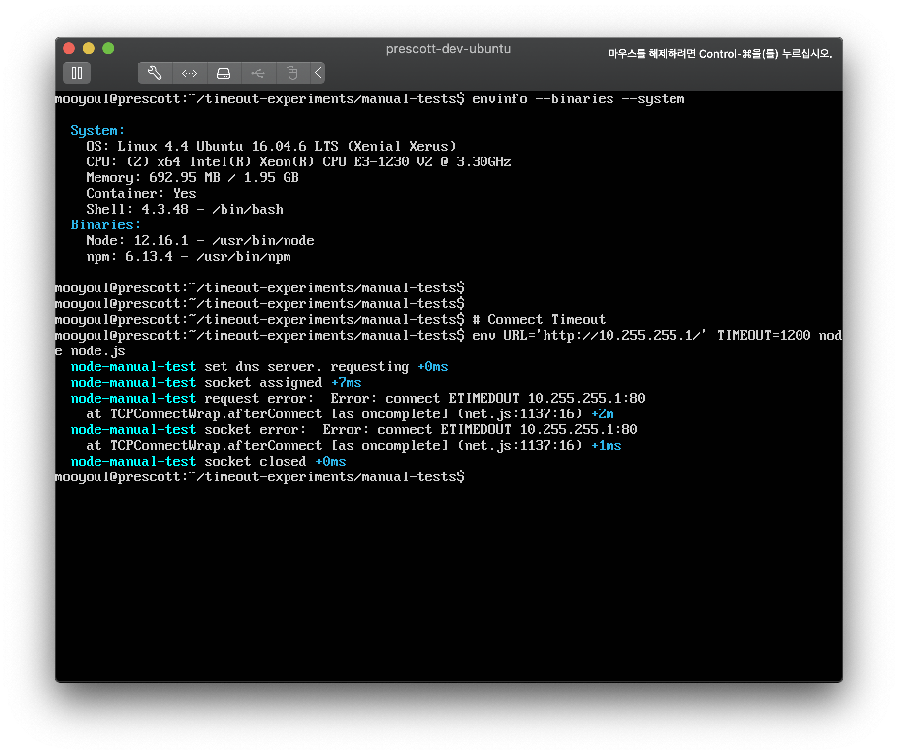
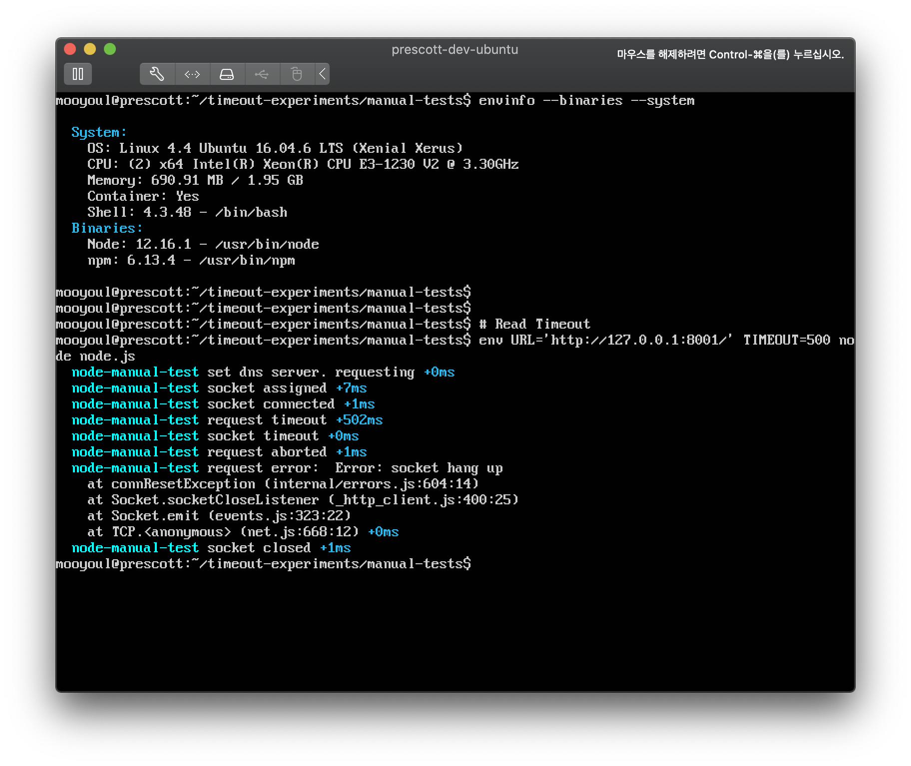
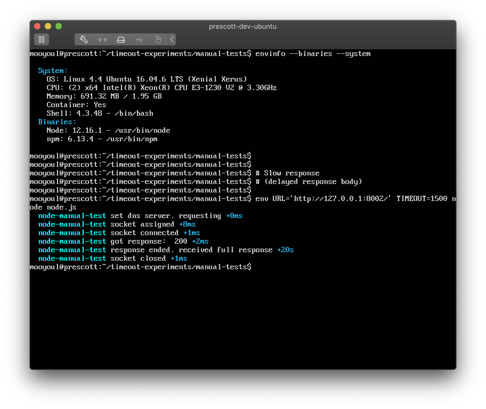

# timeout-experiments

Some experiments to know how timeouts are handled

## Types of Timeouts

#### DNS Lookup Timeout

"DNS Lookup Timeout" indicates that client submitted the query to the DNS server, 
but didn't get a response in specified time.

It usually occurs when the DNS server you queried was having a problem and couldn't reply. 
Network errors could be another reason as well.

#### Connect Timeout

"Connect Timeout" indicates that client created socket and sent "TCP SYN" packet to server,
but server dropped SYN packet and never replied SYN-ACK packet in specified time.

You can quickly reproduce "Connect Timeout" by connecting to non-routable destination like `10.255.255.1`.

It usually occurs when server firewall drops SYN packets. Bad network connectivity could be another reason as well.

> See also: http://willbryant.net/overriding_the_default_linux_kernel_20_second_tcp_socket_connect_timeout

#### Read Timeout

"Read Timeout" indicates that time of inactivity between two data packets 
when waiting for the server's response exceeded specified time.

It usually occurs when server was super busy. Bad network condition could be another reason as well.

#### Write Timeout

"Write Timeout" indicates that time of inactivity between two data packets 
when sending the request to the server exceeded specified time.

It usually occurs when server was super busy. Bad network condition could be another reason as well.

#### Call Timeout 

"Call Timeout" indicates that "complete" HTTP call didn't completed in specified time.
It includes entire timings from DNS Lookup to Response body download.
 

## Comparision Matrix

| Types | XHR | Node |
| ----- | ---- | ---- |
| DNS Lookup Timeout | No | No |
| Connect Timeout | No | Partial (only supports detection) Can't customize connect timeout. Follows OS-wide setting. |
| Read Timeout | No | Limited (only supports idle timeout configuration) | 
| Write Timeout | No | Limited (only supports idle timeout configuration) |
| Call Timeout | Yes | No | 

## How HTTP clients handle timeouts

### XHR

There's only one timeout option that XHR provides - The "Call Timeout".
When browser detects call timeout, request will be aborted.

##### DNS Timeout in IE 11

##### DNS Timeout in Chrome

##### Read Timeout in IE 11 (by delaying response header write)

##### Read Timeout in Chrome (by delaying response header write)

##### Call Timeout in IE 11 (by simulating slow response body writing)

##### Call Timeout in Chrome (by simulating slow response body writing)

### Node.js

Currently, Built-in HTTP client only supports "idle timeout" detection.

DNS Lookup timeouts, Connect Timeout, and Call Timeout aren't supported 
and can be implemented in user-land if needed.

And also there are no "Read Timeout" or "Write Timeout" support. 
but Node.js core only supports "idle timeout" detection, 
which can be used for "Read Timeout" or "Write Timeout" detection.

##### DNS Timeout

As you can see, `timeout` option does not trigger any `timeout` or  `error` events.

   

##### Connect Timeout

As you can see, `timeout` option does not trigger any `timeout` events. but `error` event was triggered with `ETIMEDOUT` code. 
Also, You can see that the time to trigger `ETIMEDOUT` error exceeded specified timeout - which means `timeout` option wasn't respected.     

##### Read Timeout (by delaying response header write)

As you can see, `timeout` option was respected and socket triggered `timeout` event.

##### Call Timeout (by simulating slow response body writing)

As you can see, There's no "Call Timeout" support. Supplied timeout was 500ms 
and response ended after 20 seconds, but there were no any `timeout` events.  

  
 

## License
[MIT](LICENSE)

See full license on [mooyoul.mit-license.org](http://mooyoul.mit-license.org/)
